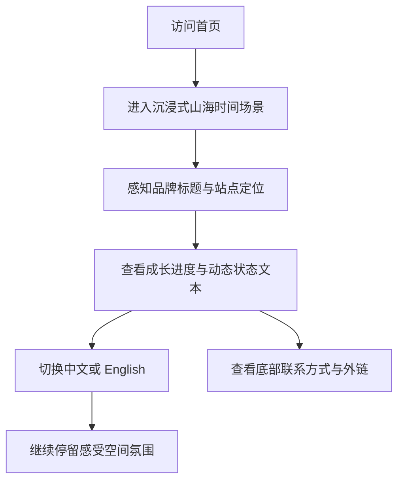

## 1. 产品概述
山海行 / TERRAFLUX 是一个以“东方自然主义 × AI 数字实验室 × 成长轨迹空间”为核心气质的个人沉浸式主页，用于表达创作者在山海、时间与技术之间的持续探索。
- 面向关注 AI、数字创作、长期成长与东方美学表达的人群，承载个人品牌、后续博客内容与项目展示入口。
- 产品目标不是信息堆叠，而是通过可沉浸、可呼吸、可延展的首页建立鲜明记忆点与可信的长期更新框架。

## 2. 核心功能

### 2.1 功能模块
1. **首页**：沉浸式 3D 背景、品牌标题、成长进度、动态短句、语言切换、底部联系信息。

### 2.2 页面详情
| 页面名称 | 模块名称 | 功能描述 |
|-----------|-------------|---------------------|
| 首页 | 顶部品牌区 | 展示极简 SVG Logo、站点名称、右上角中英切换入口，保持高留白与低干扰。 |
| 首页 | 沉浸式 Three.js 场景 | 通过雾化粒子、地形等高线、时间流线与天干地支漂浮符号构建“山海与时间流动”的氛围背景。 |
| 首页 | Hero 主视觉 | 居中展示中文主标题“山海行”和英文标题“TERRAFLUX”，配合慢速显隐与微动态营造呼吸感。 |
| 首页 | 副标题区 | 输出中英双语说明文本，表达“在山海与时间之间，记录 AI、成长与探索”的站点核心定位。 |
| 首页 | Growth Progress | 以非 Loading 语义的进度条呈现“人生与系统持续构建中”的概念，支持流动质感与数字百分比展示。 |
| 首页 | 动态文字轮播 | 以缓慢淡入淡出轮播中英短句，如构建系统、训练模型、探索时间、记录成长。 |
| 首页 | 时间符号层 | 低透明度展示随机组合的天干地支与“年、月、日、时”等时间符号，体现数字化东方时间长河。 |
| 首页 | 底部信息区 | 展示 GitHub、Email、技术栈署名，视觉弱化但清晰可读，作为后续内容系统的轻导航入口。 |

## 3. 核心流程
访客进入首页后，首先感知到一个具有山海、时间、风与水流气质的数字空间，在极简主视觉中理解站点身份；随后通过成长进度与动态轮播短句认识创作者的持续构建状态；最后可通过语言切换和底部联系信息建立进一步连接。整个体验强调停留、感受与记忆，而非快速跳转。

## 4. 用户界面设计
### 4.1 设计风格
- 主色：玄黑、墨灰、深水蓝，用于背景层次与空间深度。
- 辅色：青灰、岩石灰、雾白，用于信息层级、辅助线条与次级文本。
- 点缀色：极克制暗金与微金属流光，仅用于进度条高光、Logo 细节与局部聚焦。
- 按钮样式：轻描边、半透明、低对比、悬停时带有微弱辉光与位移，不采用商业化主按钮风格。
- 字体策略：中文采用有金石与书卷感的标题字系，英文字体采用克制但具有雕塑感的展示字与中性正文字体搭配。
- 布局策略：桌面优先、中心聚焦、纵向层叠、留白驱动，避免传统营销站的密集区块。
- 图形风格：山形线条、水流轨迹、地形图纹理、时间符号、雾粒子、细噪点叠层。

### 4.2 页面设计概览
| 页面名称 | 模块名称 | UI 元素 |
|-----------|-------------|-------------|
| 首页 | 顶部品牌区 | 极简 Logo、细线品牌名、语言切换器、半透明磨砂容器、低对比悬停反馈。 |
| 首页 | Three.js 背景 | 远景雾粒子、地形线框、时间流线、漂浮符号、缓慢摄像机漂移、深色雾化背景。 |
| 首页 | Hero 主视觉 | 超大标题、英文副标题、柔和字距、分层显隐、低速漂移动效。 |
| 首页 | Growth Progress | 金属质感轨道、呼吸式内发光、百分比文本、淡流光扫描、非工具化语义。 |
| 首页 | 动态文字轮播 | 居中排版、慢速渐隐切换、低亮度文本、轻微上浮或横向位移。 |
| 首页 | 底部信息区 | 极淡分隔线、外链文本、技术说明、长留白、弱化交互。 |

### 4.3 响应式策略
- 采用桌面优先设计，保证在大屏设备上形成完整沉浸空间。
- 平板端保留背景层次与核心视觉，但降低 Three.js 几何密度与排版宽度。
- 移动端保留品牌识别、标题、副标题、成长进度和轮播文本，压缩场景复杂度并优化触控尺寸。
- 针对 `prefers-reduced-motion` 提供低动画模式，减少摄像机漂移、粒子更新频率与文本切换动画幅度。

### 4.4 3D 场景指引
- 环境与氛围：深色无 HDRI 写实环境，采用程序化雾感、远近层叠与粒子空间营造山中数字实验室氛围。
- 灯光设置：以低强度冷色环境光为基底，辅以极弱暖金方向光和局部体积感高光，避免强对比炫技照明。
- 相机设置：透视相机固定在轻微俯视或平视角度，带有非常缓慢的漂移与视差呼吸感。
- 构图元素：前景为稀疏雾粒子，中景为等高线与流线，远景为朦胧山势层与时间符号深度分布。
- 交互与动画：仅使用轻度视差、滚动无依赖或极弱响应、持续慢速更新；不做强交互炫技。
- 后期效果：轻微泛光、噪点、暗角、色调映射与雾化，不使用重度光污染或高饱和后期。
- 性能预算：桌面端保持 60fps 目标，移动端自动降级粒子与线条数量，控制 draw calls 与透明对象数量。

## 5. 内容与语义约束
- 首页文案必须克制、留白，避免使用营销式表达或技术参数堆砌。
- 英文内容风格保持诗性与工程感平衡，不使用过度商业化 slogan。
- 天干地支内容第一版使用随机组合即可，不接入真实农历系统。
- Growth Progress 必须表达“持续构建中”，而不是“正在加载”。

## 6. 后续扩展预留
- 顶部品牌区预留博客与项目入口扩展位。
- 主页信息架构支持后续挂接博客列表、实验项目列表、时间轴与关于页。
- 国际化词条与内容模块需按命名空间结构组织，避免后续扩展时难以维护。
