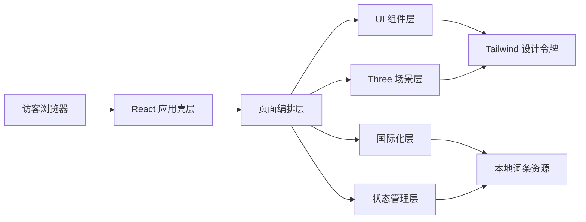
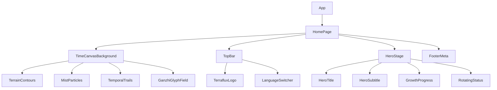

## 1. 架构设计


## 2. 技术说明
- 前端：React 18 + TypeScript + Vite 6
- 样式系统：TailwindCSS 3 + 全局 CSS 变量 + 局部组件样式
- 3D 渲染：three + @react-three/fiber + @react-three/drei
- 动画系统：framer-motion
- 国际化：i18next + react-i18next
- 状态管理：zustand
- 测试：Vitest + Testing Library
- 构建目标：Vercel 静态部署，前后端解耦

## 3. 路由定义
| 路由 | 用途 |
|-------|---------|
| / | 山海行 / TERRAFLUX 沉浸式首页 |

## 4. 模块划分
| 模块 | 职责 |
|------|------|
| `src/app` | 应用入口、全局 Provider、页面装配 |
| `src/pages` | 页面级布局与模块组合 |
| `src/components/layout` | 顶部导航、底部信息、容器与通用布局基元 |
| `src/components/hero` | 主标题、副标题、动态状态轮播、成长进度条 |
| `src/components/three` | Three.js 画布、山海粒子、等高线、时间流线、漂浮符号 |
| `src/components/branding` | SVG Logo、站点标识与品牌视觉元素 |
| `src/hooks` | 运动偏好、视口、滚动、时间符号生成等可复用逻辑 |
| `src/store` | 语言、成长进度、场景性能级别等轻量全局状态 |
| `src/locales` | i18n 配置与中英词条命名空间 |
| `src/utils` | 时间符号组合、随机数、插值与场景工具函数 |
| `src/styles` | Tailwind 入口、全局主题变量、纹理和动画工具样式 |

## 5. 组件树设计


## 6. 状态与数据策略
### 6.1 全局状态
| 状态项 | 类型 | 来源 | 说明 |
|--------|------|------|------|
| `language` | `zh | en` | `i18next` 同步 | 当前站点语言 |
| `progressValue` | `number` | 本地配置或 store | 首页成长进度百分比 |
| `sceneQuality` | `high | medium | low` | 运行时推断 | 基于设备能力和运动偏好控制场景复杂度 |

### 6.2 本地静态数据
| 数据项 | 位置 | 说明 |
|--------|------|------|
| Hero 文案 | `src/locales/*` | 中文与英文标题、副标题、状态文案 |
| 时间符号字库 | `src/utils` | 天干、地支、时间单位字符数组 |
| 品牌链接 | `src/config` 或 `src/locales` | GitHub、Email、底部说明 |

## 7. API 定义
当前 Phase 1 无后端接口，采用纯前端静态资源架构。

后续若接入博客或项目系统，优先扩展以下接口契约：

```ts
export type Locale = 'zh' | 'en'

export interface HeroContent {
  titleCn: string
  titleEn: string
  subtitle: string
  rotatingMessages: string[]
  progressValue: number
}

export interface ExternalLink {
  label: string
  href: string
}
```

## 8. 渲染与性能策略
- `Canvas` 采用固定全屏背景层，与内容层解耦，避免页面结构与 3D 场景相互污染。
- 背景特效使用程序化几何和 shader 友好逻辑优先，减少大型贴图依赖。
- 使用分层粒子密度和不同透明度批次模拟雾、水汽与风，移动端自动降低数量。
- 等高线优先用数学曲线、LineSegments 或 Catmull-Rom 曲线生成，避免高面数模型。
- 天干地支符号通过 2D 精灵或文本纹理映射实现，数量受性能预算控制。
- 动画统一使用低频、长周期变化；减少每帧重算，利用 `useMemo`、实例化与可控噪声函数。
- 对 `prefers-reduced-motion`、小屏和低性能设备提供降级路径。

## 9. 设计令牌策略
- 在 `:root` 中定义主题色、雾度、描边透明度、金属高光、背景渐变等 CSS 变量。
- Tailwind 通过扩展 `colors`、`boxShadow`、`backgroundImage`、`fontFamily`、`animation` 统一站点设计语言。
- 组件内部避免硬编码色值，优先引用主题令牌，便于后续切换季节主题或不同章节风格。

## 10. 文件与命名规范
- 组件文件采用 PascalCase，Hook 采用 `useXxx`，工具函数采用 camelCase。
- 同类复杂组件采用目录化组织，如 `components/three/TimeCanvasBackground.tsx`。
- 所有 i18n 词条按语义命名，不使用页面截图式文案键名。
- 样式优先 Tailwind 原子类与设计令牌结合，少量复杂效果保留在 `globals.css`。

## 11. 测试与质量策略
- 为时间符号生成工具、轮播 Hook、关键纯函数保留单元测试。
- 页面级渲染只补充高价值测试，如语言切换与核心文案存在性。
- 使用 ESLint 与 TypeScript 保证基础质量；提交前执行 `build`、`lint`、必要测试。

## 12. 部署方案
- 部署平台：Vercel
- 构建命令：`npm run build`
- 输出目录：`dist`
- 单页应用无需额外服务端，静态部署即可。
- 后续若接入博客 CMS，可通过独立 API 或无头 CMS 注入内容，不破坏现有首页结构。
